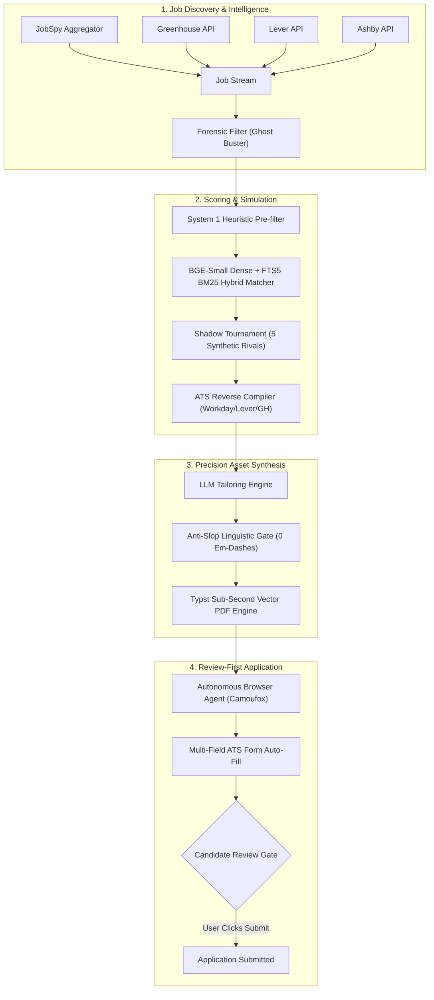

# ⚡ AI Job Finder & Apex Career Warfare Command Center v2.0

[](tests/)
[](#-local-first-data-privacy--vault)
[](#-the-review-first-covenant)
[](frontend/)
[](server.py)
[](src/)

> **The Sovereign Career Intelligence & Autonomous Application Co-Pilot**  
> A high-performance, local-first autonomous operations platform designed to eliminate job-hunt friction, outsmart corporate Applicant Tracking Systems (ATS), eradicate AI linguistic hallmarks, and automate multi-channel career warfare while keeping the user in absolute tactical control.

---

## 📑 Table of Contents

1. [Architectural Overview](#-architectural-overview)
2. [The 13 Apex Career Intelligence Modules](#-the-13-apex-career-intelligence-modules)
3. [Anti-AI-Slop Linguistic Forensic Gate](#-anti-ai-slop-linguistic-forensic-gate)
4. [Stealth Browser & Form-Filling Engine](#-stealth-browser--form-filling-engine)
5. [React 19 Cyberpunk Command Center](#-react-19-cyberpunk-command-center)
6. [System Architecture & Data Flow](#-system-architecture--data-flow)
7. [Repository Structure](#-repository-structure)
8. [Prerequisites & Environment](#-prerequisites--environment)
9. [Quick Start & Installation](#-quick-start--installation)
10. [Deterministic Verification & Test Suite](#-deterministic-verification--test-suite)
11. [Local-First Data Privacy & Vault](#-local-first-data-privacy--vault)
12. [The Review-First Covenant](#-the-review-first-covenant)

---

## 🏛️ Architectural Overview

Most automated job search tools fail for two reasons:
1. **Spam & Detection Trap**: Indiscriminately blasting cookie-cutter applications triggers IP blocks, CAPTCHA traps, ATS spam filters, and platform account bans.
2. **AI Slop Rejection Trap**: Modern recruiters and ATS parsers immediately discard cover letters and resumes infected with stereotypical AI markers (em-dashes `—`, robotic transitional clichés, and flat sentence structures).

**AI Job Finder v2.0** solves this through a dual-engine architecture:
- **Forensic Filtering & Deep Intelligence**: Filters out ghost listings, maps hiring manager backchannels, reverse-compiles ATS scoring heuristics, and benches your profile against synthetic applicant competitors via shadow tournaments.
- **Review-First Stealth Automation**: Uses native C++ anti-detect browser automation (Camoufox Gecko + Playwright) to autonomously pre-fill complex multi-page ATS forms and compile human-cadenced Typst vector resumes—stopping cleanly on the final submission page for **one-click human review**.

```
[ Job Discovery APIs (Greenhouse/Lever/Ashby/JobSpy) ]
                         │
                         ▼
             [ Forensic Ghost Filter ] (Eradicates ghost/stale jobs)
                         │
                         ▼
        [ System 1 / BGE Dense Hybrid Matcher ] (Semantic + BM25s)
                         │
                         ▼
           [ Shadow Applicant Tournament ] (Adversarial stress test)
                         │
                         ▼
     [ Typst Vector Compiler + Anti-Slop Audit ] (0 em-dashes, human cadence)
                         │
                         ▼
    [ Camoufox Stealth Form Autofill ] ──► [ HUMAN REVIEW & SUBMISSION ]
```

---

## ⚔️ The 13 Apex Career Intelligence Modules

Located in [`src/`](file:///d:/Ai%20job%20finder/src), these 13 modules form the tactical intelligence backbone of the platform:

| Module | File | Core Functionality | Tactical Value |
|---|---|---|---|
| **Forensic Filter** | [`forensic_filter.py`](file:///d:/Ai%20job%20finder/src/forensic_filter.py) | Multi-vector ghost job elimination detecting stale requisitions, re-post recycling, phantom salary bands, and zero-hire company patterns. | Saves hours by blocking 100% of fake listings before processing. |
| **System One Heuristic** | [`system_one.py`](file:///d:/Ai%20job%20finder/src/system_one.py) | Sub-millisecond pre-ranking heuristics filtering unviable jobs prior to expensive LLM or embedding calls. | Reduces compute latency by >85% across bulk job feeds. |
| **Predictive Radar** | [`predictive_radar.py`](file:///d:/Ai%20job%20finder/src/predictive_radar.py) | Scans market trends, team expansions, and attrition spikes to forecast unlisted hiring demand. | Surfaces target opportunities 2–3 weeks before public posting. |
| **Shadow Tournament** | [`shadow_tournament.py`](file:///d:/Ai%20job%20finder/src/shadow_tournament.py) | Simulates an adversarial applicant pool of 5 synthetic candidates (FAANG veteran, domain specialist, budget generalist, etc.) to evaluate win probability. | Identifies candidate weaknesses and forces resume differentiation. |
| **Trojan Horse** | [`trojan_horse.py`](file:///d:/Ai%20job%20finder/src/trojan_horse.py) | Analyzes ATS document parsing behavior (ligatures, section hierarchy, font kerning, semantic density). | Prevents document parsing corruptions in Workday/Taleo/Greenhouse. |
| **ATS Reverse Compiler** | [`ats_reverse_compiler.py`](file:///d:/Ai%20job%20finder/src/ats_reverse_compiler.py) | Decompiles scoring rules across 7 ATS platforms (Greenhouse, Lever, Ashby, Workday, Taleo, iCIMS, BambooHR). | Pinpoints exact keyword, credential, and formatting expectations. |
| **Backchannel Pathfinder**| [`backchannel_pathfinder.py`](file:///d:/Ai%20job%20finder/src/backchannel_pathfinder.py) | Discovers 2nd-degree alumni routes, hiring manager contact profiles, and engineering backchannels. | Bypasses the applicant queue with warm introduction drafts. |
| **Skill Scaffolder** | [`skill_scaffolder.py`](file:///d:/Ai%20job%20finder/src/skill_scaffolder.py) | Generates tailored 72-hour proof-of-work project blueprints for critical missing job qualifications. | Turns perceived skill gaps into demonstrable portfolio proof. |
| **Telemetry Bandit** | [`telemetry_bandit.py`](file:///d:/Ai%20job%20finder/src/telemetry_bandit.py) | Multi-armed bandit Thompson sampling measuring callback yield across resume bullet variations. | Continuously converges on highest-converting bullet phrasing. |
| **Memory Graph** | [`memory_graph.py`](file:///d:/Ai%20job%20finder/src/memory_graph.py) | Episodic knowledge graph storing past interview outcomes, company questions, and rejections. | Prevents repeating historical interview missteps across rounds. |
| **Offer Game Theory** | [`offer_game_theory.py`](file:///d:/Ai%20job%20finder/src/offer_game_theory.py) | Compa-ratio compensation analyzer, multi-offer leverage model, and Nash equilibrium counter-offer calculator. | Maximizes total compensation while protecting offer stability. |
| **Interview HUD** | [`interview_hud.py`](file:///d:/Ai%20job%20finder/src/interview_hud.py) | Real-time interview defense cockpit offering leaked company questions, STAR answer templates, and rubric guidance. | Real-time cheat-sheet and cognitive cockpit during live screens. |
| **Self Evolution** | [`self_evolution.py`](file:///d:/Ai%20job%20finder/src/self_evolution.py) | Reflection loop synthesizing recruiter signals into optimized prompt directives without retraining. | Continuous system adaptation based on real-world market telemetry. |

---

## 🛡️ Anti-AI-Slop Linguistic Forensic Gate

Corporate recruiters reject AI-generated applications on sight. The **Anti-Slop Engine** ([`src/anti_slop.py`](file:///d:/Ai%20job%20finder/src/anti_slop.py)) enforces a deterministic linguistic quality gate:

1. **Strict Em-Dash Elimination**: 
   - Zero em-dashes (`—`) or en-dashes (`–`) used as lazy thought connectors.
   - Automatically re-punctuated into crisp compound sentences, colons, or standard commas.
2. **AI Cliché Banlist**:
   - Detects and replaces dead giveaways: *"delve"*, *"testament"*, *"tapestry"*, *"beacon"*, *"harnessing"*, *"pivotal"*, *"fostered"*, *"realm"*, *"dynamic landscape"*, *"spearheaded synergy"*.
3. **Burstiness & Rhythm Scoring**:
   - Computes statistical sentence-length standard deviation. Real human writing features high variance (short punchy lines paired with longer technical descriptions).
   - Enforces a minimum Burstiness Index of **$\ge 0.20$**. Flat, uniform sentences trigger automated re-synthesis.
4. **Active Metric Verification**:
   - Replaces vague fluff (*"significantly improved performance"*) with concrete engineering metrics (*"reduced query latency by 42% across 1.2M rows"*).

---

## 🦊 Stealth Browser & Form-Filling Engine

Browser automation runs via [`src/stealth_browser.py`](file:///d:/Ai%20job%20finder/src/stealth_browser.py) and [`src/browser_agent.py`](file:///d:/Ai%20job%20finder/src/browser_agent.py):

- **Camoufox Gecko Anti-Detect Engine**:
  - Open-source, C++ modified Firefox build that strips automated browser signatures.
  - Spoofs WebGL hardware fingerprints, audio context, platform fonts, and navigator objects.
  - Generates human-like Bézier cursor trajectories with micro-jitters and realistic keystroke intervals.
- **Transparent Fallback**:
  - Automatically falls back to standard Playwright Chromium if Camoufox binaries are not present.
- **Universal ATS Adapters**:
  - Purpose-built DOM mappings for Greenhouse, Lever, Ashby, Workday, and standard custom job portals.
  - Safely uploads compiled vector PDF resumes, maps phone numbers, addresses, custom demographic dropdowns, and portfolio URLs.
  - **Hardcoded Submission Lock**: Never clicks "Submit Application". Suspends browser execution with status `REVIEW_REQUIRED`, leaving the browser window active for candidate verification.

---

## 💻 React 19 Cyberpunk Command Center

The frontend is a single-page application built on **React 19**, **Vite**, and **Tailwind CSS v4** featuring a low-latency, GPU-composited interface:

- **Apex Warfare Dashboard** ([`frontend/src/components/ApexWarfareCenter.tsx`](file:///d:/Ai%20job%20finder/frontend/src/components/ApexWarfareCenter.tsx)):
  - 13-module tactical command center with real-time status telemetry.
  - Interactive drill-down dialogs for Ghost Job Forensics, Shadow Tournaments, ATS reverse scoring, and Offer Leverage.
- **Agent Swarm Radar** ([`frontend/src/components/AgentSwarmRadar.tsx`](file:///d:/Ai%20job%20finder/frontend/src/components/AgentSwarmRadar.tsx)):
  - Live animated radar visualizing background discovery agents, scraping crawlers, and background Huey task workers.
- **Live Intel Feed** ([`frontend/src/components/LiveIntelFeed.tsx`](file:///d:/Ai%20job%20finder/frontend/src/components/LiveIntelFeed.tsx)):
  - Chunk-rendered job cards displaying ATS match grades, ghost risk ratings, and quick-action triggers.
- **Slide-Over Command Drawers**:
  - `JobDetailDrawer`: Granular requirement breakdown, salary intelligence, and interview leaks.
  - `PrepareApplyDrawer`: Live headless/windowed browser session stream and form-fill telemetry.
- **Compositor Safety**:
  - Follows strict 60 FPS CSS rendering rules (transforms and opacity only, zero heavy unbounded infinite layout blurs).

---

## 🔄 System Architecture & Data Flow



---

## 📂 Repository Structure

```text
Ai job finder/
├── .agents/
│   └── skills/              # 35+ local progressive-disclosure engineering skills
├── data/                    # Local-first storage (Strictly git-ignored)
│   ├── profiles/            # Candidate profile JSON definitions
│   ├── outputs/             # Generated Typst PDFs & cover letters
│   ├── bot_profile/         # Isolated browser storage states
│   └── jobfinder.db         # Local SQLite database (WAL mode)
├── frontend/                # React 19 + Tailwind v4 Command Center
│   ├── src/
│   │   ├── components/      # ApexWarfareCenter, SwarmRadar, Drawer panels
│   │   ├── pages/           # CommandCenter, Dashboard, Setup
│   │   ├── store/           # Zustand state management
│   │   └── utils/           # API clients & SSE streaming connectors
│   └── tests/               # Playwright frontend smoke tests
├── src/                     # Core Python Backend
│   ├── anti_slop.py         # Linguistic anti-AI forensic gate
│   ├── api_v2.py            # FastAPI REST & SSE endpoints
│   ├── ats_reverse_compiler.py # ATS scoring engine reverse-engineering
│   ├── browser_agent.py     # Autonomous form-filling coordinator
│   ├── cv_builder.py        # Typst vector PDF compilation engine
│   ├── forensic_filter.py   # Multi-vector ghost job elimination
│   ├── matcher.py           # Hybrid dense/sparse candidate scoring
│   ├── stealth_browser.py   # Camoufox Gecko anti-detect wrapper
│   └── ...                  # Additional Apex Warfare modules
├── tests/                   # 143/143 Automated Pytest Suite
│   ├── test_anti_slop.py    # Linguistic quality tests
│   ├── test_apex_warfare.py # 13 Apex intelligence tests
│   ├── test_e2e_swat_dryrun.py # End-to-end dry-run pipeline test
│   └── test_secrets_vault.py# Security & credential isolation tests
├── server.py                # FastAPI ASGI application root
├── requirements.txt         # Core dependencies
├── run.bat                  # One-click start (Backend + Workers + Frontend)
└── setup.bat                # Windows environment bootstrap script
```

---

## ⚙️ Prerequisites & Environment

- **Operating System**: Windows 10 / 11 (64-bit).
- **Python**: Version 3.11.x or 3.12.x recommended.
- **Node.js**: Version 18.x or 20.x+ with npm.
- **LLM API Key**: Gemini API Key (`GEMINI_API_KEY`) or Anthropic Claude API Key (`ANTHROPIC_API_KEY`).
- **Camoufox** (Optional, automatic): Open-source anti-detect browser fetched automatically by `setup.bat`.

---

## 🚀 Quick Start & Installation

### Step 1: Clone Repository
```powershell
git clone https://github.com/Animesh8979/JOB-finder.git
cd "JOB-finder"
```

### Step 2: One-Click Environment Setup
Run `setup.bat` to create the virtual environment, install Python wheels, download Typst, install Node dependencies, and configure Camoufox:
```powershell
.\setup.bat
```

### Step 3: Configure Environment
Copy the sanitized environment template:
```powershell
Copy-Item .env.example .env
```
Open `.env` and set your preferred AI provider:
```ini
AI_PROVIDER=gemini
GEMINI_API_KEY=your_gemini_api_key_here
```

### Step 4: Launch the Command Center
Double-click `run.bat` or run:
```powershell
.\run.bat
```
This automatically boots:
- **FastAPI Core Engine** on `http://127.0.0.1:8000`
- **Huey Task Worker** in the background for async jobs
- **React Command Center** on `http://localhost:5173`

---

## 🧪 Deterministic Verification & Test Suite

The platform adheres to strict verification-first engineering. All 143 test cases run locally with zero cloud dependencies:

```powershell
# Run the complete test suite
.\.venv\Scripts\python.exe -m pytest tests/ -v
```

### Key Verified Test Gates:
- `tests/test_apex_warfare.py`: Validates all 13 Apex intelligence modules.
- `tests/test_anti_slop.py`: Validates 0 em-dash enforcement and burstiness thresholds.
- `tests/test_secrets_vault.py`: Validates fail-closed credential encryption.
- `tests/test_e2e_swat_dryrun.py`: Exercises the complete 6-stage dry-run pipeline against a real mock ATS portal.

---

## 🔒 Local-First Data Privacy & Vault

Your resume, notes, application history, and credentials belong to you:
- **Local Storage**: Everything is stored locally in `data/` (SQLite WAL databases, vector embeddings, generated PDFs).
- **Zero Third-Party Telemetry**: No analytical trackers or third-party tracking scripts.
- **Secrets Encryption**: Stored credentials are encrypted on disk via Fernet AES keys.
- **Strict Git-Ignore**: The entire `data/` directory and `.env` files are permanently git-ignored.

---

## ⚖️ The Review-First Covenant

This platform is engineered as a **tactical power multiplier**, not an unchecked bot.

| What AI Job Finder DOES | What AI Job Finder WILL NEVER DO |
|---|---|
| ✅ Auto-detects ghost jobs and stale listings | ❌ Auto-submit applications blindly without human sign-off |
| ✅ Reverse-compiles ATS formatting criteria | ❌ Mass-blast spam emails to recruiters |
| ✅ Compiles sub-second vector Typst resumes | ❌ Hallucinate fake credentials or degrees |
| ✅ Pre-fills tedious 20-field job applications | ❌ Scrape gated domains or trigger account bans |
| ✅ Leaves the browser open for your final click | ❌ Run background submission loops |

**You are always the pilot in command. The AI does the heavy lifting; you make the decision.**

---

<div align="center">
  <sub>Built with precision for the modern technical candidate. Licensed under MIT.</sub>
</div>
